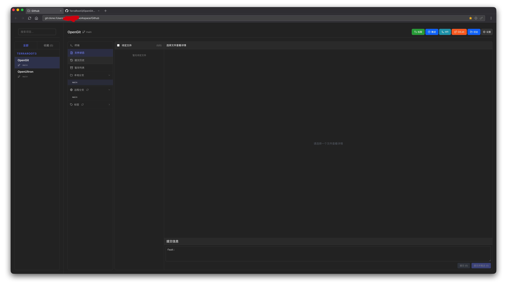

# OpenGit

[中文](#中文) | [English](#english)

---

## 中文

OpenGit 是一个基于 `Electron + Vue 3` 的桌面 Git 管理应用，面向日常开发场景，提供可视化仓库管理与高频 Git 操作能力。

### 应用特性

- 多仓库集中管理：统一查看项目状态并快速切换
- 分支全流程：本地/远程分支查看、切换、创建、删除、合并
- Tag 全流程：标签查看、创建、推送、删除、检出
- 文件状态可视化：暂存/反暂存、提交、冲突处理、stash 操作
- 协作入口：支持快速创建 Merge Request、跳转 GitLab
- 内置终端：在项目目录内直接执行命令
- AI 会话管理：按项目聚合 `Codex / Claude Code` 会话，支持查看对话记录、恢复会话与删除本地会话
- 内置 Browser 已迁移至 `WebContentsView` 主路径，支持下载状态、权限提示、崩溃恢复与隐私标签页

### 界面示例

下面是 OpenGit 的界面示例图：



### 技术栈

- 前端：`Vue 3` + `Vite`
- 桌面容器：`Electron`
- 状态管理：`src/stores`

### 环境要求

- Node.js `>= 18`（建议 LTS）
- npm `>= 9`
- Git（需已安装并可在终端执行）

### 本地开发

```bash
npm ci
npm run electron:dev
```

仅启动前端开发服务：

```bash
npm run dev
```

### 构建与打包

```bash
npm run build
npm run dist
```

按平台打包：

```bash
npm run electron:build:mac
npm run electron:build:win
npm run electron:build:linux
```

产物目录：`dist-electron/`

### 目录结构

```text
OpenGit/
├── electron/      # Electron 主进程与 IPC
├── src/           # Vue 页面与业务逻辑
├── scripts/       # 构建/发布脚本
└── build/         # 打包与签名相关配置
```

### GitHub Tag 自动发布

工作流文件：`.github/workflows/release.yml`

```bash
git tag v2.0.1
git push origin v2.0.1
```

流程会自动构建多平台包并创建 GitHub Release。

### 常见问题

1. Electron 白屏：先执行 `npm run build` 后再 `npm run electron:dev`
2. Git 操作失败：检查本机 Git 与远端凭据配置
3. 打包失败：检查平台相关依赖与签名配置

---

## English

OpenGit is a desktop Git management app built with `Electron + Vue 3`, designed for daily development workflows with a visual interface for common Git operations.

### Key Features

- Multi-repo dashboard for centralized project management
- Full branch workflow: view/switch/create/delete/merge (local + remote)
- Full tag workflow: list/create/push/delete/checkout
- Visual file-status workflow: stage/unstage/commit/conflict handling/stash
- Collaboration helpers: quick Merge Request entry and GitLab navigation
- Built-in terminal running directly in project context
- AI session management for project-scoped `Codex / Claude Code` sessions, including transcript preview, resume, and local session deletion

### Screenshot

Example UI screenshot of OpenGit:


### Tech Stack

- Frontend: `Vue 3` + `Vite`
- Desktop runtime: `Electron`
- State layer: `src/stores`

### Requirements

- Node.js `>= 18` (LTS recommended)
- npm `>= 9`
- Git installed and available in terminal

### Local Development

```bash
npm ci
npm run electron:dev
```

Frontend only:

```bash
npm run dev
```

### Build & Package

```bash
npm run build
npm run dist
```

Platform-specific packaging:

```bash
npm run electron:build:mac
npm run electron:build:win
npm run electron:build:linux
```

Output: `dist-electron/`

### Structure

```text
OpenGit/
├── electron/      # Electron main process and IPC
├── src/           # Vue UI and app logic
├── scripts/       # Build/release scripts
└── build/         # Packaging/signing configs
```

### GitHub Tag Release Automation

Workflow file: `.github/workflows/release.yml`

```bash
git tag v2.0.1
git push origin v2.0.1
```

This workflow builds multi-platform artifacts and creates a GitHub Release automatically.

### FAQ

1. White screen in Electron: run `npm run build`, then restart `npm run electron:dev`
2. Git command failure: verify Git installation and remote credentials
3. Packaging failure: verify platform dependencies/signing configuration

---

## Repository

- GitHub: https://github.com/TerraRoot3/OpenGit

## License

MIT
