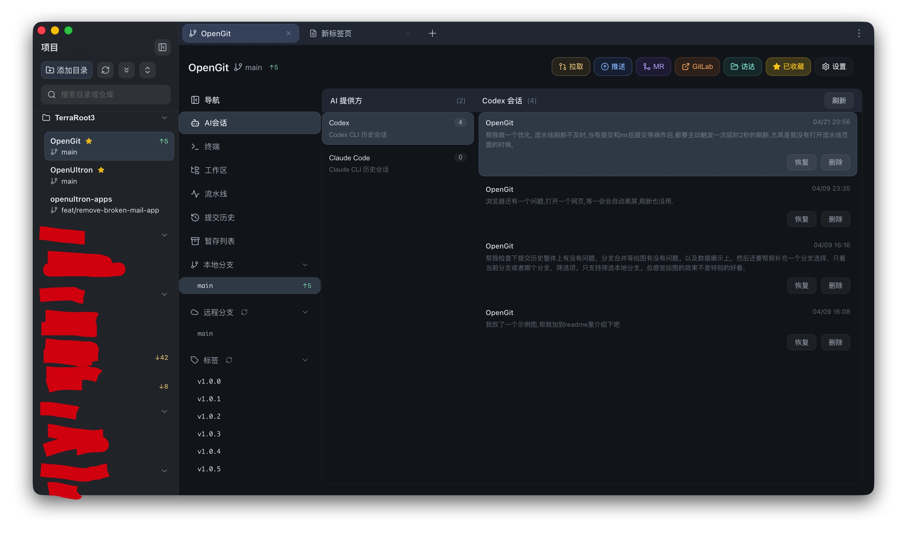
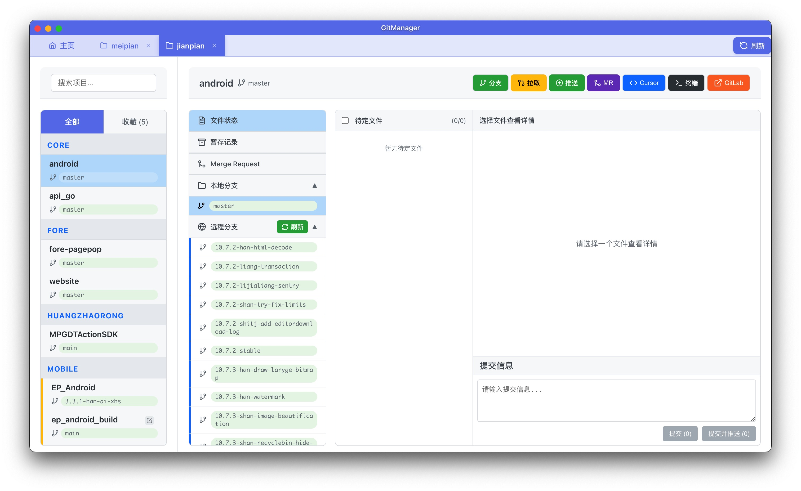

# OpenGit

[中文](#中文) | [English](#english)

OpenGit is a desktop Git client built with `Electron + Vue 3`, designed for daily development workflows.

It is positioned as a practical, lightweight alternative to `GitKraken`, with a stronger focus on project-oriented Git operations, GitLab collaboration, built-in terminal workflows, and project-scoped AI session management.




---

## 中文

### 这是什么

OpenGit 是一个面向日常开发的桌面 Git 客户端，适合替代 `GitKraken` 这类通用 Git GUI 工具来处理高频仓库操作。

它的定位不是“做一个最全的 Git 教科书界面”，而是把开发过程中真正常用的几件事放在一个地方：

- 全局项目侧边栏与扫描目录管理
- 分支 / 标签 / 提交 / 暂存
- GitLab / MR 协作入口
- GitLab Pipeline 执行状态监控
- 项目级终端工作区
- 项目级 AI 会话管理
- 内置浏览器与相关权限、下载、恢复能力

如果你想要一个更贴近日常开发、支持 GitLab、终端、AI 会话和项目视角的一体化桌面 Git 工具，OpenGit 可以作为 `GitKraken` 的轻量平替。

### 最近新增

- 新增完整主题系统，已内置 `4` 套主题：
  - `Slate Dual`
  - `Graphite Moss`
  - `Abyss Blue`
  - `Mist Paper`
- 首页设置抽屉支持主题切换，并持久化保存主题选择
- 浏览器、项目详情、工作区、终端、弹层与原生浮动菜单已接入统一主题变量
- 支持深色与浅色主题混合扩展，便于后续继续增加新皮肤
- GitLab Pipeline 在提交、推送、创建 MR、推送标签等操作后会自动触发延时刷新，并在后台跟踪运行状态
- Project Detail 顶部可直接查看当前运行中的 Pipeline 摘要状态

### 核心能力

#### 1. 项目与仓库工作台

- 左侧全局项目侧边栏，支持添加目录并在 3 级内扫描 Git 仓库
- 多仓库集中管理，统一查看项目状态并快速切换
- 项目详情页聚合分支、标签、文件状态、提交历史、终端与 AI 会话
- 项目列表按目录分组展示，并同步显示分支、待改文件、提交数与拉取数
- 支持项目单独在新标签页打开

#### 2. 高频 Git 操作

- 本地 / 远程分支查看、切换、创建、删除、合并
- 标签查看、创建、推送、删除、检出
- 文件状态可视化：暂存、反暂存、提交、冲突处理
- 暂存列表（stash）查看与恢复
- 提交历史查看与详情展开

#### 3. 协作能力

- GitLab 快速打开
- 快速创建 Merge Request
- 常见远端同步操作可视化
- GitLab Pipeline 子页面：查看进行中的与最近的流水线
- Project Detail 头部显示当前运行中的 GitLab Pipeline 状态，并自动轮询更新

#### 4. 终端工作区

- 项目内置终端
- 支持 `灵动终端` 模式，适合快速聚焦当前项目命令操作
- 支持 `分屏终端` 模式，适合并行执行多组命令
- 从浏览器菜单以新标签页打开独立终端
- 终端内容快照恢复
- 无限水平 / 垂直分屏
- 分屏拖拽调节大小
- 分屏拖拽交换位置

#### 5. AI 会话管理

- 按当前项目聚合 `Codex` 与 `Claude Code` 历史会话
- 默认进入 AI 会话页，提供方列表优先展示 `Codex`
- 查看对话记录
- 一键恢复会话到终端
- 删除本地会话记录

#### 6. 内置浏览器

- 基于 `WebContentsView` 的内置 Browser
- 支持下载状态、权限提示、崩溃恢复
- 支持隐私标签页与独立页面管理
- 地址栏联想弹窗、首页浏览器菜单等原生浮层已适配主题

#### 7. 主题与界面系统

- 统一的 `theme token` 结构，支持语义色、组件别名和后续一键换肤扩展
- 主链路界面已完成主题化：项目详情、工作区、终端、内置浏览器、菜单、弹窗
- 常用功能按钮支持按语义分色，并随主题自动调整明暗与对比度

### 适合谁

OpenGit 更适合这类用户：

- 日常需要同时处理多个 Git 仓库
- 主要使用 GitLab 协作
- 希望在 Git GUI 里直接完成大部分终端和仓库操作
- 同时使用 `Codex` / `Claude Code`，希望把 AI 会话和项目关联起来
- 想找一个比 `GitKraken` 更轻量、更偏“项目工作台”的桌面客户端

### 技术栈

- 前端：`Vue 3` + `Vite`
- 桌面容器：`Electron`
- 终端：`xterm.js` + `node-pty`
- 状态层：`src/stores`

### 环境要求

- Node.js `>= 18`，建议使用 LTS
- npm `>= 9`
- Git 已安装，并且可在终端直接执行

### 本地开发

```bash
npm ci
npm run electron:dev
```

仅启动前端开发服务：

```bash
npm run dev
```

### 构建与打包

```bash
npm run build
npm run dist
```

按平台打包：

```bash
npm run electron:build:mac
npm run electron:build:win
npm run electron:build:linux
```

产物目录：

```text
dist-electron/
```

### 目录结构

```text
OpenGit/
├── electron/      # Electron 主进程、窗口、IPC、Browser/Terminal 集成
├── src/           # Vue 页面、组件、业务逻辑、stores
├── scripts/       # 构建、测试、发布辅助脚本
└── build/         # 打包、签名与平台配置
```

### GitHub Tag 自动发布

工作流文件：

```text
.github/workflows/release.yml
```

发布方式：

```bash
git tag v2.0.1
git push origin v2.0.1
```

工作流会自动构建多平台产物并创建 GitHub Release。

### 常见问题

#### 1. Electron 打开白屏

先执行：

```bash
npm run build
```

然后再启动：

```bash
npm run electron:dev
```

#### 2. Git 操作失败

优先检查：

- 本机 Git 是否安装正确
- 远端凭据是否可用
- 终端内网络 / 代理配置是否正确

#### 3. 打包失败

优先检查：

- 平台相关依赖是否齐全
- Electron 缓存是否损坏
- 签名与权限配置是否正确

---

## English

### What It Is

OpenGit is a desktop Git client for daily development work.

It is intended to be a practical, lightweight alternative to `GitKraken`, especially for teams and developers who want a project-centered workflow with Git, GitLab, terminal tooling, and AI session management in one place.

Instead of trying to expose every Git concept equally, OpenGit focuses on the workflows developers actually use every day:

- global project sidebar with scan-root management
- repository management
- branches, tags, commits, and stash
- GitLab / Merge Request entry points
- GitLab Pipeline monitoring
- project terminal workspace
- project-scoped AI session management
- built-in browser with download, permission, and recovery support

### Recent Additions

- A complete theme system with `4` built-in themes:
  - `Slate Dual`
  - `Graphite Moss`
  - `Abyss Blue`
  - `Mist Paper`
- Theme switching from the Home settings drawer, with persisted selection
- Unified theme tokens now cover the browser, project detail views, workspace, terminal, dialogs, and native floating popups
- Theming now supports both dark and light theme expansion cleanly
- GitLab Pipeline refresh is now triggered automatically after commit, push, MR-related submit flows, and tag push operations
- Project Detail now keeps a running pipeline summary visible in the header

### Core Capabilities

#### 1. Project-Centered Repository Management

- Global project sidebar with scan-root management and Git repository discovery within 3 directory levels
- Manage multiple repositories from one desktop client
- Unified project detail page for branches, tags, file status, commit history, terminal, and AI sessions
- Project list grouped by directory, with branch, pending-file, ahead, and behind indicators
- Open a project in its own tab

#### 2. High-Frequency Git Operations

- View, switch, create, delete, and merge local / remote branches
- View, create, push, delete, and checkout tags
- Visual file-status workflow for stage, unstage, commit, and conflict handling
- Stash list and restore workflow
- Commit history inspection

#### 3. Collaboration Flow

- Open GitLab directly from the app
- Quick Merge Request creation
- Visual remote sync operations
- GitLab Pipeline page for active and recent pipeline runs
- Header-level running pipeline summary in Project Detail with automatic polling

#### 4. Terminal Workspace

- Built-in project terminal
- Supports a `Focus Terminal` mode for quick project-scoped command work
- Supports a `Split Terminal` mode for parallel command workflows
- Open standalone terminal tabs from the browser menu
- Terminal snapshot restore
- Unlimited horizontal / vertical pane splitting
- Draggable pane resizing
- Draggable pane swapping

#### 5. AI Session Management

- Aggregate project-scoped `Codex` and `Claude Code` sessions
- Default to the AI sessions page, with `Codex` shown before `Claude Code`
- Inspect transcripts
- Resume sessions directly into terminal
- Delete local session files

#### 6. Built-In Browser

- Browser flow based on `WebContentsView`
- Download status, permission prompts, and crash recovery
- Private tabs and standalone page management
- Native suggestion popups and floating browser menus are theme-aware

#### 7. Theme & UI System

- Formal `theme token` architecture with semantic tokens and component aliases
- High-frequency surfaces are now theme-driven: Project Detail, workspace, terminal, built-in browser, menus, and dialogs
- Common action buttons use semantic functional colors that adapt to the active theme

### Who It Is For

OpenGit is a strong fit if you:

- work across multiple Git repositories every day
- mainly collaborate through GitLab
- want terminal and Git workflows inside the same desktop tool
- use `Codex` or `Claude Code` and want sessions grouped by project
- want something lighter and more project-oriented than `GitKraken`

### Tech Stack

- Frontend: `Vue 3` + `Vite`
- Desktop runtime: `Electron`
- Terminal: `xterm.js` + `node-pty`
- State layer: `src/stores`

### Requirements

- Node.js `>= 18` (LTS recommended)
- npm `>= 9`
- Git installed and available in terminal

### Local Development

```bash
npm ci
npm run electron:dev
```

Frontend only:

```bash
npm run dev
```

### Build & Package

```bash
npm run build
npm run dist
```

Platform-specific packaging:

```bash
npm run electron:build:mac
npm run electron:build:win
npm run electron:build:linux
```

Output directory:

```text
dist-electron/
```

### Project Structure

```text
OpenGit/
├── electron/      # Electron main process, windows, IPC, Browser/Terminal integration
├── src/           # Vue pages, components, business logic, stores
├── scripts/       # Build, test, and release helper scripts
└── build/         # Packaging, signing, and platform-specific config
```

### GitHub Tag Release Automation

Workflow file:

```text
.github/workflows/release.yml
```

Release with:

```bash
git tag v2.0.1
git push origin v2.0.1
```

This workflow builds multi-platform artifacts and creates a GitHub Release automatically.

### FAQ

#### 1. Electron opens to a blank window

Run:

```bash
npm run build
```

Then start again:

```bash
npm run electron:dev
```

#### 2. Git operations fail

Check:

- local Git installation
- remote credentials
- terminal network / proxy configuration

#### 3. Packaging fails

Check:

- platform-specific dependencies
- Electron cache integrity
- signing and permission configuration

---

## Repository

- GitHub: https://github.com/TerraRoot3/OpenGit

## License

MIT
