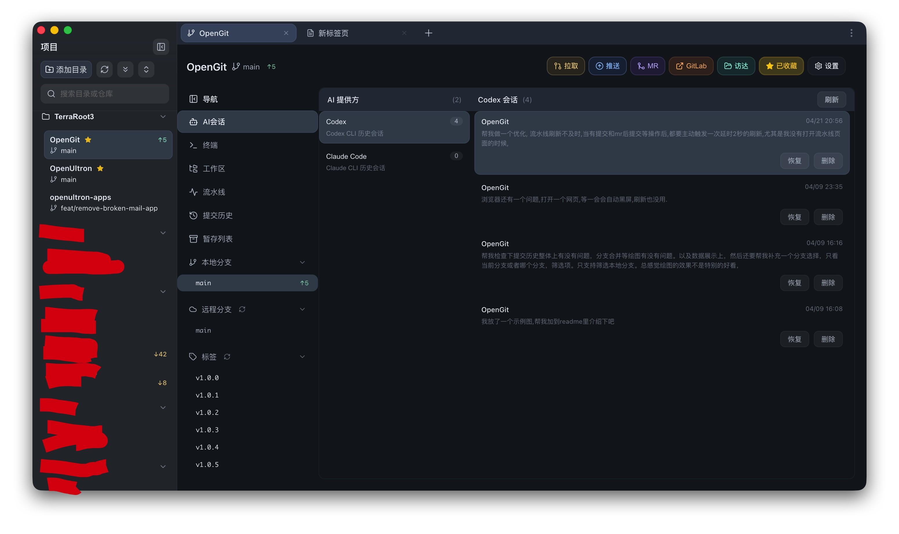
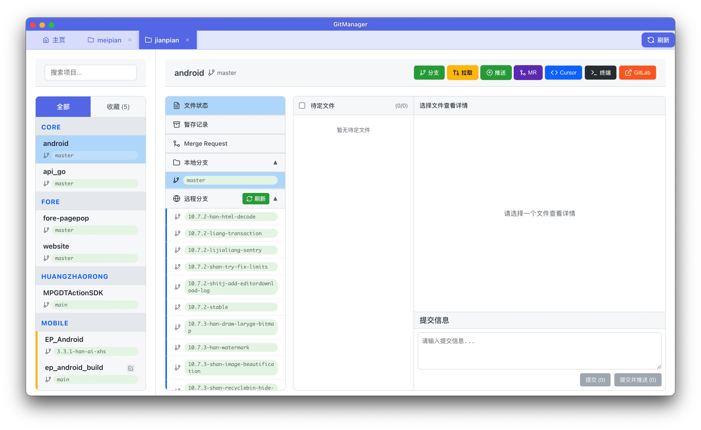

# OpenGit

[中文](#中文) | [English](#english)

OpenGit is a project-centered desktop Git client built with Electron and Vue 3.




---

## 中文

### 这是什么

OpenGit 是一个面向日常开发的桌面 Git 客户端。它把高频仓库操作、GitLab / GitHub / Gitee 协作、项目终端和项目级 AI 会话集中在一个工作区中。

应用通过左侧项目侧边栏管理仓库，并在主区域以原生工作区标签同时打开多个项目。工作区右上菜单提供远端仓库、灵动终端、分屏终端、备份管理和皮肤页面；需要访问仓库、流水线等网页时，会交给系统默认浏览器打开。
退出后会保存当前打开的原生工作区页面、标签顺序和激活页，并在下次启动时恢复。

### 核心能力

#### 项目与仓库

- 添加扫描目录，并在 3 级目录内发现 Git 仓库
- 按目录分组展示多个仓库
- 从侧边栏打开多个项目工作区标签并快速切换
- 显示分支、待改文件、领先和落后状态

#### Git 操作

- 查看、切换、创建、删除和合并本地 / 远程分支
- 查看、创建、推送、删除和检出标签
- 暂存、反暂存、提交与冲突处理
- 查看和恢复 stash
- 查看提交历史与文件差异

#### 远端协作

- 支持 GitLab、GitHub 和 Gitee
- 快速创建 Merge Request / Pull Request
- 查看 GitLab Pipeline 与 GitHub Actions 状态
- 提交、推送、创建 MR/PR 或推送标签后自动刷新流水线状态
- 仓库和流水线网页由系统默认浏览器打开

#### 项目终端

- 项目内置终端
- 工作区右上菜单可分别新建灵动终端和分屏终端标签
- 水平 / 垂直分屏、拖拽调节和交换
- 终端内容快照恢复
- Codex 会话状态同步与后台通知
- 点击通知可打开对应项目并聚焦终端

#### AI 会话

- 按当前项目聚合 Codex 与 Claude Code 会话
- 查看对话记录
- 恢复会话到项目终端
- 重命名、归档和删除本地会话

#### 主题

- 7 套内置主题与跟随系统模式
- 皮肤选择迁移到独立工作区页面
- 项目详情、工作区、终端、菜单和弹层使用统一主题变量
- 同时支持深色与浅色主题

#### 配置备份

- 工作区右上菜单可打开独立备份管理页面
- 支持项目侧边栏、远端仓库、项目工作区、皮肤和终端偏好的导出与恢复
- 不会导入已移除的收藏、浏览历史、密码、壁纸或 MCP 配置

### 技术栈

- 前端：Vue 3 + Vite
- 桌面容器：Electron
- 终端：xterm.js + node-pty
- 状态层：`src/stores`

### 环境要求

- Node.js `>= 18`，建议使用 LTS
- npm `>= 9`
- Git 已安装并可从终端执行

### 本地开发

```bash
npm ci
npm run electron:dev
```

仅启动前端开发服务：

```bash
npm run dev
```

### 构建与打包

```bash
npm run build
npm run dist
```

按平台打包：

```bash
npm run electron:build:mac
npm run electron:build:win
npm run electron:build:linux
```

产物位于 `dist-electron/`。

### 目录结构

```text
OpenGit/
├── electron/      # Electron 主进程、窗口与 IPC
├── src/           # Vue 页面、组件、业务逻辑与 stores
├── scripts/       # 构建、测试与发布辅助脚本
└── build/         # 打包、签名与平台配置
```

### 版本与发布

日常修改写入 `CHANGELOG.md` 的 `Unreleased`。准备新版本时：

```bash
npm run release:prepare -- 1.4.10
npm run release
git add package.json package-lock.json CHANGELOG.md
git commit -m "chore: prepare release v1.4.10"
git tag v1.4.10
git push origin main --tags
```

推送 `vX.Y.Z` 标签后，GitHub Actions 会构建多平台产物并创建 GitHub Release。

---

## English

### What It Is

OpenGit is a desktop Git client for daily development. It combines common repository operations, GitLab / GitHub / Gitee collaboration, project terminals, and project-scoped AI sessions in one workspace.

Repositories are managed from the project sidebar and opened as native workspace tabs, so multiple projects can remain open. The top-right workspace menu opens Remote Repositories, Focus Terminal, Split Terminal, Backup Management, and the Themes page. Repository and pipeline web pages open in the system default browser.
Open native workspace pages, tab order, and the active page are restored on the next launch.

### Core Capabilities

#### Projects & Repositories

- Add scan roots and discover Git repositories within three directory levels
- Group repositories by directory
- Open and switch between multiple project workspace tabs from the sidebar
- Show branch, changed-file, ahead, and behind status

#### Git Operations

- View, switch, create, delete, and merge local / remote branches
- View, create, push, delete, and check out tags
- Stage, unstage, commit, and resolve conflicts
- Inspect and restore stashes
- Inspect commit history and file diffs

#### Remote Collaboration

- GitLab, GitHub, and Gitee support
- Quick Merge Request / Pull Request creation
- GitLab Pipeline and GitHub Actions status
- Automatic pipeline refresh after commit, push, MR/PR creation, and tag push
- Repository and pipeline pages open in the system default browser

#### Project Terminal

- Built-in project terminal
- Create separate Focus Terminal and Split Terminal tabs from the top-right workspace menu
- Horizontal / vertical splitting, resizing, and pane swapping
- Terminal snapshot restoration
- Codex session status and background notifications
- Notification clicks open the matching project and focus its terminal

#### AI Sessions

- Project-scoped Codex and Claude Code sessions
- Transcript inspection
- Resume sessions in the project terminal
- Rename, archive, and delete local sessions

#### Themes

- Seven built-in themes plus Follow System
- Theme selection lives on a dedicated workspace page
- Shared theme tokens across project details, workspace, terminal, menus, and dialogs
- Dark and light theme support

#### Configuration Backup

- Open Backup Management from the top-right workspace menu
- Export and restore project sidebar, remote repository, workspace, theme, and terminal preferences
- Removed favorites, browsing history, passwords, wallpapers, and MCP settings are never imported

### Tech Stack

- Frontend: Vue 3 + Vite
- Desktop runtime: Electron
- Terminal: xterm.js + node-pty
- State layer: `src/stores`

### Requirements

- Node.js `>= 18` (LTS recommended)
- npm `>= 9`
- Git installed and available in the terminal

### Local Development

```bash
npm ci
npm run electron:dev
```

Frontend only:

```bash
npm run dev
```

### Build & Package

```bash
npm run build
npm run dist
```

Platform-specific packaging:

```bash
npm run electron:build:mac
npm run electron:build:win
npm run electron:build:linux
```

Build artifacts are written to `dist-electron/`.

### Project Structure

```text
OpenGit/
├── electron/      # Electron main process, windows, and IPC
├── src/           # Vue pages, components, business logic, and stores
├── scripts/       # Build, test, and release helpers
└── build/         # Packaging, signing, and platform configuration
```

### Versioning & Releases

Daily changes go under `Unreleased` in `CHANGELOG.md`. To prepare a release:

```bash
npm run release:prepare -- 1.4.10
npm run release
git add package.json package-lock.json CHANGELOG.md
git commit -m "chore: prepare release v1.4.10"
git tag v1.4.10
git push origin main --tags
```

Pushing a `vX.Y.Z` tag triggers the GitHub Actions workflow that builds platform artifacts and creates the GitHub Release.
